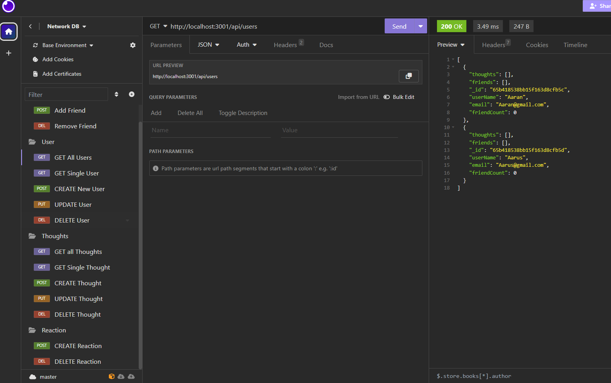

# Network-Data-API
Creating back end application to store and modifies data from user 

## Description

In this project I wanted to create back end application for Network-API to store data about User, Thoughts, and Reaction. I wanted to create Models for tihs data, also Controllers to manipulate data info. To understand more about functionalities of the app please watch a video I mdae. 

## Table of Contets

- [Screenshots](#screenshots)
- [Links](#links)

## Screenshots

In this section I provided screenshots of the  Insomnia that has all routes with all functionallity.

<!--  -->

## Links

In this section I added links to the YouTube video with all app's functionalities and to the GitHub repositories with the original codebase.

The Video Link
    https://www.youtube.com/watch?v=5eBtjLBdlqcLinks 

GitHub Code Repository:
    https://github.com/MykhailoZakh/Network-Data-APILinks 